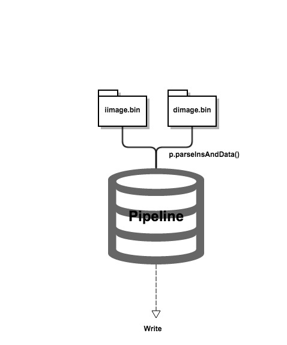
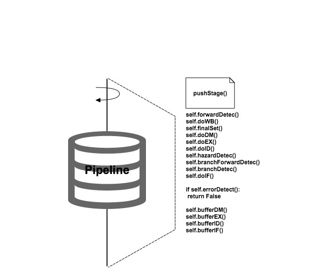

## Project#2 Report

### Program Flow Chart
***
1. Main Chart  
&emsp;&emsp;Here is the main flow chart in the ```main``` function
<div style="text-align: center">


2. Pipeline  
&emsp;&emsp;Here the pipeline is a ```Class``` in ```pipeline.py```. In pipeline, the main fucntion is the ```pushStage()```, there is a ```while``` loop, normally, every loop is a cycle, and in a loop, two parts are essential, actions in ```stage``` and buffer stage into ```stagebuffer```  


### Detailed Description
***
1. Classes(OPP)
	
 + 	Instruction
 
	&emsp;&emsp;All the instruction will be transformed into the object of this class, I can easily get every specific part by the the symbol ```.```.
 
	 ```python
	 binStr: 
	 	the binary string format of this instruction, 32 bits
	 insType: 
	 	the type, can be 'r', 'i', 'j' and 's'
	 parse(): 
	 	the function can parse the fundamental part, like 'rt', 'rs', etc.
	 ```  
 + Data

 	&emsp;&emsp;Just like the Instruction class, the Data class makes it easy to get the binary format of the data. It's just like the parser of the data.
 
	 ```python
	 binStr: 
	 	I can easily get the binary strings which are store in a list
	 ```
 + Register
 
 	&emsp;&emsp;This class is just like a simulator registor in this project, it has 32 registers and LO, HI, PC as its attributes. The condition of each cycle is also stored in here. Here are some main methords

	```python
	getSignDecByBin(self, idx): 
		get the decimal format in the register, and the rsgister index is in binary format
	set(self, idx, value): 
		set the value into the register with idx
	```

 + Pipeline 
 
   &emsp;&emsp;This class here is for pipeline controling, two important part are do stage actions and do buffer, further, ```hazard detection```, ```branch detection``` and ```forward detection``` are also essential.  
   &emsp;&emsp;I divided different tasks of different stages into different methord of the pipeline class, and separate the buffer too.   
 
 
```python
self.doWB()
self.doDM()
self.doEX()
self.doID()
self.doIF()
self.bufferDM()
self.bufferEX()
self.bufferID()
self.bufferIF()
```   
   
&emsp;&emsp;Furthermore, the ```forward``` and ```hazard``` detection are implemented below
   
   
```python
self.forwardDetec()
self.hazardDetec()
self.branchForwardDetec()
self.branchDetec()
```
   
2. Signal in Pipeline  
  &emsp;&emsp;All the signal in pipeline are implemented by ```dict``` type in python, I use different number express different signal
  
  ```python
self.controlEX = {'ALUSrc': -1, 'ALUOp': -1, 'RegDst': -1, 'DoMult':-1}
self.controlDM = {'MemWrite': -1, 'MemRead': -1, 'BrcOp': -1}
self.controlWB = {'RegWrite': -1, 'MemtoReg': -1} 
  ```
  
3. How to do buffer  
  &emsp;&emsp;Here is the example of buffering, after do the action in stages, do buffer to buffer the info. There are two parts, ```controlBuffer``` and ```bufferDict```, they are dictionary and also the attribute in the ```stageBuffer``` class 
  
  ```python
  def bufferDM(self):
		self.DM_WB.controlBuffer = {'EX': self.EX_DM.controlBuffer['EX'].copy(), 
					'DM': self.EX_DM.controlBuffer['DM'].copy(), 'WB': self.EX_DM.controlBuffer['WB'].copy()}
		self.DM_WB.bufferDict = {'ins': self.DM.ins, 'insName': self.DM.insName,
					'PC_bin32': self.DM.PC_bin32,
					'readDataFromMem_bin32': self.DM.readDataFromMem_bin32, 
				        'readDataFromALU_bin32': self.DM.readDataFromALU_bin32,
					'writeRgst_bin5': self.DM.writeRgst_bin5}
  ```
   
   
### Test Case Design. 
***

&emsp;&emsp;The first import part in my test case is a jump to the front of the initial pc, as the behaviours of the gloden simulator, in this case, the pc will jump back with the instruction of NOP to the initial pc and start again.		
&emsp;&emsp;Here is the details.  
		
```MIPS
	lw	  $0, 0($0)  	# "write to $0"
	lw    $1, 16($0) 	# $1 = 7fffffff
	addi  $2, $1, 4  	# $2 = $1 + 4, "Number Overflow", $2 = 80000003
	bne   $3, $4, flag      # ($3 = $4 = 0) if $3 != $4, jump to flag
	xor   $1, $2, $3 	# $3 = $2 xor $1, $3 = fffffffc, next bne will jump to flag
	j 	  0x0000002c 	# for test jumping to the front of init pc
flag: 	addi  $2, $1, 5  	# $2 = $1 + 5, "Number Overflow", $2 = 80000004
```

&emsp;&emsp;Here are also some trick for forwarding.   
&emsp;&emsp;If we write data into \$0 in last instruction, and this cycle we use ```bne``` to judge the data in \$0, there is no fowarding.
&emsp;&emsp;Another test case tests for the forward below overflow.

```MIPS
	lw  $2 16($0)   # $2 = ffffffff
	lw  $3 16($0)   # $3 = ffffffff
	add $0 $2 $3
	bne $0 $0 flag1 # if rs or rt = 0, there is no fwd
	add $1 $2 $3
flag1:  add $1 $2 $3
	bne $1 $2 flag2 # test the fwd of overflow
	sub $4 $2 $3 
flag2:  sll $0 $0 0
```


